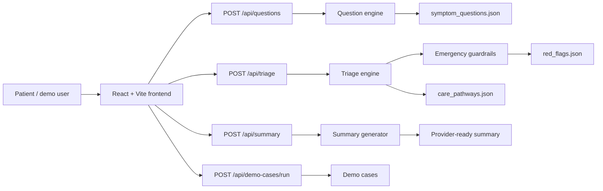

# Project Report: SafeCare Triage

## 1. Problem Statement

Patients often arrive at care settings without knowing whether they need emergency services, urgent same-day assessment, routine primary care, or self-care with monitoring. A conversational assistant can collect symptom information early, but healthcare triage must be safety-first, explainable, and deterministic rather than relying on uncontrolled language model judgment.

SafeCare Triage is an educational prototype that demonstrates how an AI-style intake experience can be paired with inspectable rules and emergency overrides.

## 2. Solution Overview

SafeCare Triage provides:

- A React conversational intake UI.
- A structured `PatientCase` model behind the conversation.
- Symptom-specific adaptive questions.
- Hard-coded emergency guardrails.
- Rule-based urgency scoring after emergency rules are checked.
- Care pathway guidance and provider-ready summaries.
- A demo test dashboard for safety cases.

The system does not diagnose. It routes to a care level using conservative, deterministic logic.

## 3. Architecture

## 4. Safety-First Design

The backend always evaluates emergency guardrails before ordinary scoring. If a guardrail matches, the result is immediately `EMERGENCY_NOW`; scoring cannot downgrade it.

Emergency override examples include:

- Chest pain with arm, jaw, neck, or back pain, shortness of breath, sweating, or fainting.
- Stroke-like symptoms such as face drooping, arm weakness, slurred speech, sudden confusion, one-sided weakness, or sudden vision loss.
- Sudden severe headache or worst headache with neurological, infection, seizure, rash, or injury warning signs.
- Severe breathing difficulty, blue lips, inability to speak full sentences, collapse, or unresponsiveness.
- Severe bleeding, seizure, loss of consciousness, or anaphylaxis warning signs.

The system includes basic synonym and informal phrase support, including:

- `seene me dard` to chest pain
- `left haath pain` to left arm pain
- `saans phoolna` to shortness of breath
- `sir dard` to headache
- `bolne me dikkat` to speech difficulty
- `chehra latakna` to face drooping

## 5. Adaptive Questioning Logic

The question engine detects a complaint category from the structured case and normalized symptom text. It then selects 1 to 4 relevant questions from `symptom_questions.json`, prioritizing red-flag questions and skipping already answered items.

Categories:

- Chest pain
- Headache
- Neurological or stroke-like symptoms
- Breathing difficulty
- Fever or infection
- Abdominal pain
- Injury or bleeding
- General

This prevents the app from asking the same generic questions for every symptom.

## 6. Triage Tiers

The prototype classifies each case into exactly one tier:

- `EMERGENCY_NOW`: call emergency services now.
- `AE_TODAY`: go to A&E or emergency department today.
- `GP_URGENT`: urgent GP or primary care appointment.
- `GP_ROUTINE`: routine GP or primary care appointment.
- `SELF_CARE`: self-care with monitoring and escalation guidance.

Each tier has a care pathway in `care_pathways.json` with:

- What to do now.
- What to tell the provider.
- Red flags to watch for.
- Safety disclaimer.

## 7. Guardrail Rules

Guardrails are implemented in `backend/app/safety_guardrails.py` and documented in `backend/app/rules/red_flags.json`.

The guardrail engine:

- Normalizes text and selected answers.
- Applies basic synonym mapping.
- Avoids matching simple negated phrases such as "no shortness of breath".
- Converts inverted safety answers, such as "Can you speak full sentences?" answered "No", into emergency evidence.
- Returns matched rule, reason, tier, and evidence.

## 8. Demo Cases and Results

The project includes 12 demo cases in `backend/app/demo_cases.py`.

| Case | Expected tier |
| --- | --- |
| Chest pain + left arm pain + shortness of breath | `EMERGENCY_NOW` |
| Sudden worst headache | `EMERGENCY_NOW` |
| Face drooping + slurred speech | `EMERGENCY_NOW` |
| Severe breathing difficulty + blue lips | `EMERGENCY_NOW` |
| Fever + confusion + stiff neck | `EMERGENCY_NOW` |
| Severe bleeding after injury | `EMERGENCY_NOW` |
| Mild chest burning after spicy food | `SELF_CARE` |
| Mild headache after screen use | `SELF_CARE` |
| Sore throat + mild fever, stable breathing | `SELF_CARE` |
| Abdominal pain with persistent vomiting | `AE_TODAY` |
| Cough for two weeks, no breathing difficulty | `GP_ROUTINE` |
| Minor ankle sprain, able to walk | `SELF_CARE` |

The backend test suite verifies that all emergency demo cases classify as `EMERGENCY_NOW`, mild similar cases are not classified as emergency, and uncertainty for serious complaints escalates conservatively.

## 9. Limitations

- This is not clinically validated and must not be used for real patient triage.
- Rules are intentionally simplified for an educational assignment.
- It does not cover every symptom, condition, age group, medication risk, or regional care pathway.
- It does not provide diagnosis or treatment.
- It does not replace emergency services, clinicians, local protocols, or professional judgment.

## 10. Future Improvements

- Clinician review tools for authoring and approving rule changes.
- Expanded pediatric, pregnancy, mental health, medication, and chronic disease pathways.
- More robust multilingual symptom normalization.
- Accessibility testing with screen readers and keyboard-only workflows.
- Audit logs, privacy controls, and consent flows.
- Integration with real scheduling, nurse advice, and emergency routing services in a regulated environment.
